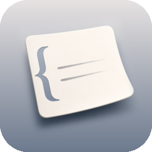
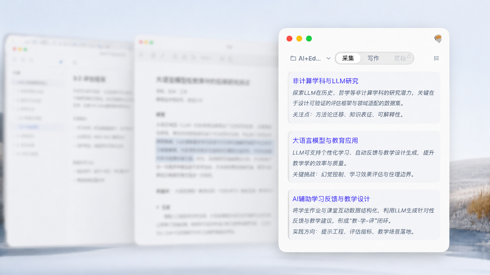

<div align="center">
  <h1>&nbsp;FloatNote</h1>
</div>

<p align="center">
  
</p>

<div align="center">
  <p>一款悬浮在桌面上、帮助你从阅读到写作的本地笔记工具。</p>
  <p>
    <a href="https://github.com/NanshineLoong/FloatNote/releases/download/v0.1.0/FloatNote_0.1.0_aarch64.dmg"><strong>下载 macOS 预览版 · Apple Silicon</strong></a>
    &nbsp;·&nbsp;
    <a href="https://github.com/NanshineLoong/FloatNote/releases/download/v0.1.0/FloatNote_0.1.0_x86_64.dmg"><strong>下载 macOS 预览版 · Intel</strong></a>
  </p>
  <p>Windows 版本正在准备中</p>
</div>

## 为什么是 FloatNote？

1. 笔记窗口始终悬浮，随时记录，不打断当前工作
2. 一次只打开一个项目，把注意力留给眼前的内容
3. 采集区与写作区并排，边看材料，边写观点
4. 笔记以 Markdown 文件保存在本地，随时可以查看、备份和迁移
5. AI 通过追问和梳理帮助你想清楚，而不只是给出答案

## 从阅读到形成自己的观点

<table>
<tr>
<td width="42%" valign="middle">
<h3>随手捕捉，不打断当前工作</h3>
<p>置顶的笔记窗始终在手边，无需离开正在使用的应用。划选内容后，可以快速采集、翻译，或带着原文向 AI 提问。</p>
</td>
<td width="58%" align="center" valign="middle">
<video src="https://github.com/user-attachments/assets/285785c3-c792-4485-b122-fd0899244412" controls muted playsinline preload="metadata" poster="assets/posters/02-capture.jpg" width="100%" aria-label="FloatNote 悬浮捕捉、翻译与提问功能演示"></video>
</td>
</tr>
</table>

<table>
<tr>
<td width="58%" align="center" valign="middle">
<video src="https://github.com/user-attachments/assets/d316515a-72b4-48e7-87dd-8f72f870322c" controls muted playsinline preload="metadata" poster="assets/posters/03-dual-panel.jpg" width="100%" aria-label="FloatNote 采集区与写作区双栏工作区演示"></video>
</td>
<td width="42%" valign="middle">
<h3>边看材料，边写观点</h3>
<p>采集区保存阅读时记下的内容，写作区用来整理和展开自己的观点。材料与文章并排呈现，不必在不同页面之间来回切换。</p>
</td>
</tr>
</table>

<table>
<tr>
<td width="42%" valign="middle">
<h3>用追问帮助你想清楚</h3>
<p>FloatNote 的 AI 不只给出答案，也会通过追问、梳理、规划和共同写作，帮助你形成自己的判断。</p>
</td>
<td width="58%" align="center" valign="middle">
<video src="https://github.com/user-attachments/assets/a6f85cf4-7eec-4f66-ac57-c31e33ce541b" controls muted playsinline preload="metadata" poster="assets/posters/04-socratic-ai.jpg" width="100%" aria-label="FloatNote AI 追问与变更确认功能演示"></video>
</td>
</tr>
</table>

| AI 能力 | 支持内容 |
| --- | --- |
| 基础能力 | 读取与检索项目内容、创建与修改文章、更新行动清单、添加与管理标签、搜索与读取网页 |
| 内置 Skills | 问到真懂、梳理材料、下一步、写出所想 |
| AI 提供商 | OpenAI、Anthropic、DeepSeek、Kimi、智谱、阿里云百炼 |

## 笔记直接保存在本地

<table>
<tr>
<td width="58%" align="center" valign="middle">
<video src="https://github.com/user-attachments/assets/9297a1c1-1687-4aad-a3d8-3af3050aeff9" controls muted playsinline preload="metadata" poster="assets/posters/05-local-files.jpg" width="100%" aria-label="FloatNote 本地 Markdown 文件与项目空间演示"></video>
</td>
<td width="42%" valign="middle">
<p>笔记、行动清单和文章直接保存在你选择的本地文件夹中，并使用 Markdown 格式。你可以用熟悉的文件工具查看、备份和迁移，不依赖 FloatNote 才能访问自己的内容。</p>
</td>
</tr>
</table>

## 整理、行动与版本回顾

<table>
<tr>
<td width="33%" align="center" valign="top">
<video src="https://github.com/user-attachments/assets/a2823cd5-0fbf-4358-9153-1ceee3ee8387" controls muted playsinline preload="metadata" poster="assets/posters/06-tags.jpg" width="100%" aria-label="FloatNote 标签功能演示"></video>
<h3>标签</h3>
<p>为重要片段添加标签，方便整理和查找零散内容。</p>
</td>
<td width="33%" align="center" valign="top">
<video src="https://github.com/user-attachments/assets/a1aea003-0afa-4770-909c-dad44068dc85" controls muted playsinline preload="metadata" poster="assets/posters/07-action-menu.jpg" width="100%" aria-label="FloatNote 行动菜单与下一步行动功能演示"></video>
<h3>下一步行动</h3>
<p>通过行动菜单明确接下来可以执行的事情。</p>
</td>
<td width="33%" align="center" valign="top">
<video src="https://github.com/user-attachments/assets/b6ff4ac7-7e67-4a18-8c58-db65b2c8e00b" controls muted playsinline preload="metadata" poster="assets/posters/08-versions.jpg" width="100%" aria-label="FloatNote 文章版本管理功能演示"></video>
<h3>版本管理</h3>
<p>保存并回看文章的不同版本，了解内容是怎样一步步形成的。</p>
</td>
</tr>
</table>

## 下载与开始使用

- **Apple Silicon Mac**（M1/M2/M3/M4 及后续芯片）：[直接下载 `.dmg`](https://github.com/NanshineLoong/FloatNote/releases/download/v0.1.0/FloatNote_0.1.0_aarch64.dmg)
- **Intel Mac**：[直接下载 `.dmg`](https://github.com/NanshineLoong/FloatNote/releases/download/v0.1.0/FloatNote_0.1.0_x86_64.dmg)
- **所有版本**：[查看 GitHub Releases](https://github.com/NanshineLoong/FloatNote/releases)
- **Windows**：正在准备中。
- **首次使用**：划词采集需要授予系统辅助功能权限；FloatNote 会在需要时引导你完成设置。

## 从源码运行

需要 Node.js 22.19 或更高版本、Rust stable，以及 macOS 或 Windows 对应的 Tauri 开发环境。

```bash
npm install
npm run tauri dev
```

更多信息可查看[开发环境](docs/development/setup.md)、[测试说明](docs/development/testing.md)和[架构总览](docs/architecture/overview.md)。

## 参与项目

欢迎反馈问题、提出功能建议或提交改进。开始前请先阅读[贡献指南](CONTRIBUTING.md)，了解开发环境、提交规范与验证流程。

## 许可证

本项目基于 [MIT License](LICENSE) 开源，版权归 FloatNote contributors 所有。
