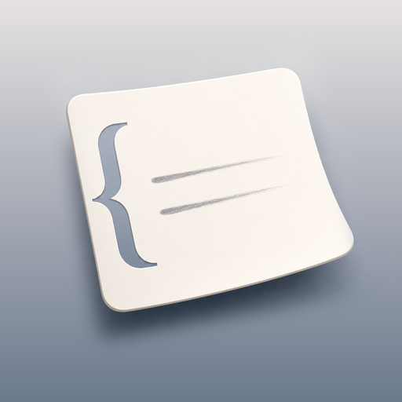

<div align="center">
  
  <h1>FloatNote</h1>
  <p>一款悬浮在桌面上、陪你从捕捉走向写作的本地优先笔记工具。</p>
  <p><strong>macOS</strong> · Windows 正在准备 · 本地优先</p>
  <p><a href="https://github.com/NanshineLoong/FloatNote/actions/workflows/ci.yml"></a></p>
</div>

<!--
头图准备好后，在这里加入：docs/assets/readme/01-hero.png。
-->

## 为什么是 FloatNote？

灵感常常出现在阅读、研究和工作途中。FloatNote 停留在当前工作区上方，让收集、整理和写作保持在同一条思考路径里：看到值得留下的内容时随手收集，需要深入理解时继续追问，准备表达时直接展开写作。

## 从遇见信息，到形成自己的内容

### 随手捕捉，不打断当前工作

悬浮置顶的笔记窗始终在手边，无需离开正在使用的应用。划选内容后，可以快速采集、翻译，或带着原文继续向 AI 提问。

<!-- 截图：docs/assets/readme/02-capture.png -->

### 让材料与写作彼此照见

采集区保存沿途遇见的线索，写作区承接逐渐形成的观点。双栏工作区让素材和文章并排呈现，不必在多个页面之间来回切换。

<!-- 截图：docs/assets/readme/03-dual-pane.png -->

### AI 帮你想清楚，而不是替你思考

FloatNote 通过追问、梳理、规划和共同写作推动思考。需要修改内容时，它会先展示变更，再由你决定是否应用。

<!-- 截图：docs/assets/readme/04-socratic-ai.png -->

| AI 能力 | 支持内容 |
| --- | --- |
| 基础能力 | 读取与检索项目内容、创建与修改文章、更新行动清单、添加与管理标签、搜索与读取网页 |
| 内置 Skills | 问到真懂、梳理材料、下一步、写出所想 |
| AI 提供商 | OpenAI、Anthropic、DeepSeek、Kimi、智谱、阿里云百炼 |

## 把内容留在自己手中

笔记、行动清单和文章直接保存在你选择的本地文件夹中，并使用 Markdown 格式。你可以用熟悉的文件工具查看、备份和迁移，不依赖 FloatNote 才能访问自己的内容。

> 使用 AI 功能时，完成请求所需的内容会发送给你配置的 AI 提供商。

<!-- 截图：docs/assets/readme/05-local-files.png -->

## 细节也服务于思考

<!--
截图：
- docs/assets/readme/06-tags.png
- docs/assets/readme/07-action-menu.png
- docs/assets/readme/08-versions.png
-->

| 标签 | 下一步行动 | 版本管理 |
| --- | --- | --- |
| 为重要片段添加标签，让零散内容获得清晰的语义。 | 通过行动菜单记下下一步，把想法逐渐变成可以执行的事情。 | 保存并回看文章的不同版本，在修改中保留重要变化。 |

## 下载与开始使用

- **macOS**：从 [GitHub Releases](https://github.com/NanshineLoong/FloatNote/releases) 下载最新预览版 `.dmg`。
  - Apple Silicon（M1/M2/M3/M4 及后续芯片）：选择文件名包含 `aarch64` 的版本。
  - Intel Mac：选择文件名包含 `x86_64` 的版本。
- **Windows**：正在准备中。
- **首次使用**：划词采集需要授予系统辅助功能权限；FloatNote 会在需要时引导你完成设置。

> [!WARNING]
> 当前 macOS 预览版使用 ad-hoc 签名，尚未经过 Apple 公证。请只从本项目官方 GitHub Releases 下载。首次打开时，macOS 可能阻止应用运行。

### 首次打开未公证预览版

1. 打开 `.dmg`，将 FloatNote 拖入“应用程序”。
2. 尝试打开 FloatNote 一次。
3. 打开“系统设置 → 隐私与安全性”，在安全性区域点击“仍要打开”，确认后再次启动。

如果系统没有显示“仍要打开”，且你已经确认应用来自本项目官方 Release，可以在终端执行：

```bash
xattr -dr com.apple.quarantine /Applications/FloatNote.app
```

这个命令只应对可信来源的 FloatNote 执行。不要通过全局关闭 Gatekeeper 来运行应用。

## 从源码运行

需要 Node.js 22.19 或更高版本、Rust stable，以及 macOS 或 Windows 对应的 Tauri 开发环境。

```bash
npm install
npm run tauri dev
```

更多信息可查看[开发环境](docs/development/setup.md)、[测试说明](docs/development/testing.md)和[架构总览](docs/architecture/overview.md)。

## 参与项目

欢迎反馈问题、提出功能建议或提交改进。开始前请先阅读[贡献指南](CONTRIBUTING.md)，了解开发环境、提交规范与验证流程。

## 许可证

本项目基于 [MIT License](LICENSE) 开源，版权归 FloatNote contributors 所有。
