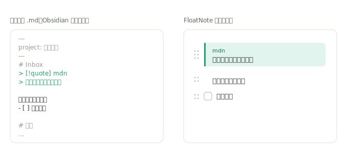
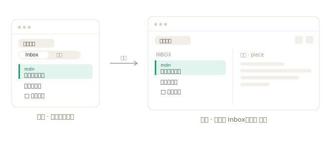
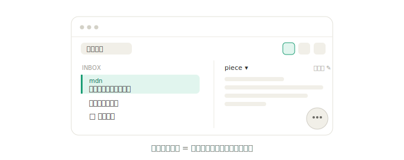

# FloatNote 项目空间（Project Spaces）设计

状态：设计已确认，待转实现计划
日期：2026-06-26

## 背景与目标

FloatNote 现在是「扁平单目录 + 时间戳命名的 `.md`」的单页记录工具。本次升级把它变成一条完整的阅读—整理工作流：阅读时随手把材料拉进 **Inbox**，沉淀后排布成 **成品**，并用一份 **清单** 不断明确下一步。

贯穿全程的两条原则：

1. **轻**：FloatNote 的身份是浏览器旁的浮动小窗。新结构不能把它做成需要「管理」的笔记系统。
2. **纯 Markdown、无私有格式**：所有内容都是标准 Markdown，能被 Obsidian 及任意编辑器原生打开、编辑、双链。卡片只是 FloatNote 对标准块的**渲染**，不是新的存储格式。

## 核心概念：项目空间

一个**项目空间 = 工作目录下的一个文件夹**，内含三类 Markdown：

```
阅读笔记/                 ← 一个项目空间
├── _inbox.md            →  Inbox 空间（块式草稿）
├── _tasks.md            →  清单空间（- [ ] 列表）
└── piece.md  (…)        →  成品笔记（默认 piece.md，可 1..N 份）
```

命名约定：**带 `_` 前缀的是系统固定文件（`_inbox.md` / `_tasks.md`）；不带前缀的 `.md` 都算成品**。于是成品天然可以有多份，无需额外元数据。

工作目录下「文件夹 = 项目空间」「松散 `.md` = 旧的平铺笔记」二者并存。

## 三处空间

### 1. Inbox —— 轻量块编辑器

底层是 `_inbox.md`，「块」= Markdown 的顶层块。每个块 hover 出把手，可**拖动重排、删除**。这是「Notion 块的手感」的轻量版——**不做**斜杠菜单、嵌套折叠、分栏、数据库等富块系统。

块到 Markdown 的映射：

- 剪藏 → callout 引用块 `> [!quote] 来源`
- 待办 → `- [ ]`（勾选写回 `- [x]`，渲染为划掉）
- 其余 → 普通段落 / 自由文本

同一份 `.md`，FloatNote 渲染成卡片，Obsidian 渲染成原生 callout，双向无损：



### 2. 成品 —— 写成文的编辑器

沿用现有的 editor / preview。顶部带一个**笔记切换器**：在项目内多份成品之间切换、新建、**直接重命名**（成品 = 文件夹内不带 `_` 前缀的 `.md`，默认 `piece.md`）。Inbox / tasks 始终各一份，成品则是 1..N 份。

### 3. 清单 —— 可开关的独立面板

`_tasks.md` 的勾选视图，作为一个可开 / 关的独立小面板，**只看本项目**。就地添加下一步、打勾、划掉。不做全局聚合、不做跨项目清单——任务就地写在 `_tasks.md`，磁盘上只有一份真相。

## 布局：宽度驱动，单窗自适应

复用 FloatNote 现有的连续布局曲线思路（见 `src/note/layout.ts`：助手随窗宽内嵌 / 浮起）。**不引入显式「模式」开关，也不开第二个窗口**——同一个窗随宽度自适应：



- **窄窗（采集）**：单栏，Inbox / 成品 分段切换。助手按现状内嵌或浮起；清单为弹出面板。
- **宽窗（整理）**：顶栏出现「分屏」开关 → Inbox 左 ｜ 成品 右。窄到放不下两栏时自动收回单栏切换。
- 「展开」按钮一键把窗口撑宽进入整理。三栏超宽布局（`Inbox｜成品｜助手`）留作以后。

宽窗里两种都能要：**单栏 + 助手内嵌**，或 **分屏 + 助手浮起**。

### 助手与分屏：右侧一个槽，二选一

把右侧空间想成**一个槽**：

- **单栏模式**（窄窗，或宽窗未开分屏）：右槽 = 内嵌助手，即今天的行为，不变。
- **分屏模式**（宽窗 + 开分屏）：右槽 = 成品栏，助手顺势落回 **Floating**（右下角小苏格拉底，要用时点开）。

分屏 = 用成品栏换掉内嵌助手的位置；Floating 模式是现成的，**零新增状态**。这也是对的 UX：拖块整理时不需要助手常驻，需要润色时点开浮层即可。



## 导航与捕获

- 顶栏左侧 = **项目空间切换器**：下拉列出工作目录下的项目文件夹，点选切换、可新建。
- **新建项目** = 建一个新文件夹 + 铺好 `_inbox.md` / `_tasks.md` / `piece.md` 三件套。
- **捕获**（快捷键 / 粘贴，沿用现有 capture / quote 流程）落入**当前项目**的 `_inbox.md`，作为一个新剪藏块（callout，带来源）。

## 第一版非目标（明确不做）

- **不做「提炼」机制**：Inbox → 成品 由用户手动搬运，无块移动 / AI 蒸馏。
- **不做全局 Inbox、不做跨项目清单**。
- **不做完整 Notion 块引擎**：无斜杠菜单 / 嵌套 / 分栏。
- **不迁移旧平铺笔记**：旧 `.md` 照常可开，新旧并存。
- **不做三栏超宽布局**。

## 对现有代码的影响（概览）

- 数据层：`src-tauri/src/notes.rs` 由「列目录里的 `.md`」扩展为「列项目空间文件夹」「在项目内按 `_` 前缀区分系统文件与成品」「新建项目时铺三件套」。
- 前端：`src/note/` 新增 Inbox 块视图与块操作、成品多文件切换 / 重命名、清单面板；`layout.ts` 扩展出分屏档与「右槽二选一」规则；`topbar.ts` 的笔记下拉演化为项目空间切换器 + 成品切换器。
- 助手：复用现有 inline / floating 行为，新增「分屏时强制 floating」的触发条件。

具体拆解留给实现计划（writing-plans）。
