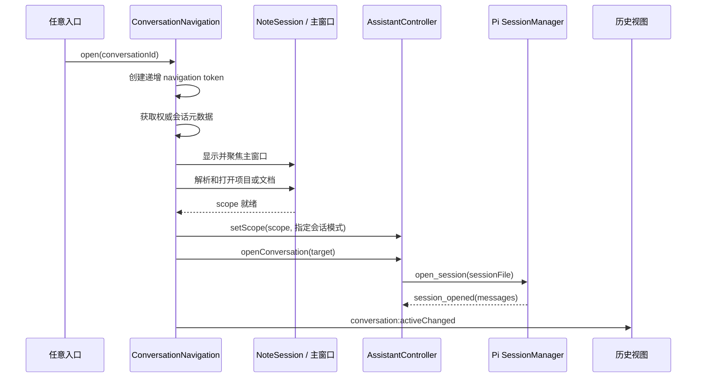
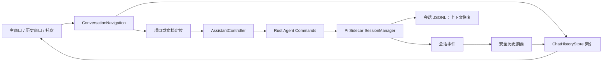

# 对话历史、项目筛选与记录管理设计

**日期：** 2026-07-11  
**状态：** 已确认，待实施  
**范围：** FloatNote 主窗口助手、独立历史窗口、托盘最近对话、Rust 历史索引与 Pi sidecar 会话协作。

## 目标

让用户能够按项目和时间快速找到、打开并管理历史对话；无论从项目内历史、独立历史窗口还是托盘入口打开对话，均使用同一套项目定位、会话加载和选中态同步逻辑。

## 已确认的产品决定

- 历史列表采用“**顶部项目筛选 + 全局时间线分组**”信息架构。
- 项目筛选与“今天 / 昨天 / 更早”等时间分组必须同时存在。
- 记录尾部使用三点菜单；单条菜单仅包含“重命名”和“删除”。
- “清理旧记录”是历史窗口右上角的独立入口，不属于单条记录菜单。
- 所有删除与清理都需二次确认，并明确提示“删除后无法恢复”。
- 默认历史保存：用户消息、AI 最终回复、消息时间、模型、项目/文档归属、标题、创建/更新时间和工具调用摘要。
- 不保存 thinking/中间推理全文，不将其放入历史 DTO，也不将其用于后续恢复上下文。
- 自动标题由 AI 异步生成；用户手动重命名后，自动生成不得覆盖该标题。

## 非目标

- 不引入新的全局状态管理框架或第三方 store。
- 不让前端读取、筛选或依赖 Pi session JSONL 的私有格式。
- 不实现全文消息搜索；筛选范围仅为项目/文档，时间组用于浏览。
- 不保存完整工具输入、完整工具输出或 thinking 内容作为历史索引。

## 信息架构与界面

独立历史窗口使用单一的时间线。顶部的项目下拉是过滤器，不会改变列表结构；过滤后列表仍然按本地日期分组。

```text
┌─────────────────────────────────────────────────────┐
│                                           [清理旧记录]│
│  项目  [ 全部项目 ▾ ]                                 │
│                                                       │
│  今天                                                 │
│  ┌─────────────────────────────────────────────────┐│
│  │ ▌ 当前对话标题                              [⋯] ││
│  │   项目名称 · 14:32 · 模型名称                     ││
│  └─────────────────────────────────────────────────┘│
│  ┌─────────────────────────────────────────────────┐│
│  │   另一条对话                                [⋯] ││
│  │   项目名称 · 09:18                               ││
│  └─────────────────────────────────────────────────┘│
│                                                       │
│  昨天                                                 │
│  …                                                    │
│                                                       │
│                  [加载更多]                           │
└─────────────────────────────────────────────────────┘
```

### 历史窗口规则

- 移除页面工具栏标题文字、左上角时钟图标和手动刷新按钮。
- 创建原生历史窗口时移除原生标题文本，但保留操作系统的窗口控制行为。
- 进入窗口、重命名、删除、清理和会话更新事件都自动刷新/同步数据；不提供手动刷新。
- 项目下拉包含“全部项目”及按最近活动排序的项目/独立文档。
- 当前会话通过高对比背景、左侧状态条和 `aria-current` 标识。若筛选结果包含该会话，则必须保持选中。
- 模型为次级元数据；旧会话缺失模型时不展示空占位。
- 列表具有明确的加载、空、筛选为空和错误状态，避免异步重新加载时内容跳动。

### 单条记录操作

三点菜单仅含：

1. **重命名**：打开输入对话框；保存后更新所有视图、托盘最近会话和标题状态。
2. **删除**：进入统一的两步不可恢复删除流程。

“清理旧记录”在窗口右上角提供。第一步选择保留期限（例如 7 天或 30 天），系统计算受影响数量；第二步显示确认信息。

### 不可恢复操作

所有单条删除和批量清理均使用统一确认流程。最终确认页必须包含：

> 删除后无法恢复。
>
> 这会永久删除本地保存的对话及其会话数据。

执行中禁用相应触发器，防止重复提交。失败时不乐观移除记录，并展示可恢复的错误信息。

删除完成后的状态规则：

- 非当前会话被删除：当前项目、当前会话和选中态不变。
- 当前会话被删除：在当前 scope 中打开下一条最近会话；没有可用会话时保留当前项目/文档，进入空白“新对话”状态。
- 批量清理包含当前会话时使用同一回退规则。
- 所有视图（独立历史窗口、主窗口历史、托盘最近记录）订阅统一更新事件，不自行维护副本状态。

## 统一对话导航

### 问题

当前全局历史通过 `chat://open` 发送整个会话对象，项目内历史直接调用助手打开逻辑；项目 scope 切换又会异步恢复最近会话。因此项目、当前会话和选中态分散在不同组件中，延迟返回的“恢复最近会话”可能覆盖用户从历史列表指定的目标。

### 方案

新增一个轻量的 `ConversationNavigation` 协调器，而非引入全局 store。所有入口只传入 `conversationId`，不传递可能过时的会话对象：

- 独立历史窗口记录点击；
- 主窗口项目内历史；
- 托盘最近对话；
- 未来的搜索或快捷入口。

协调器与 `NoteSession` 一起构成当前项目、scope、当前会话的唯一前端权威来源。历史窗口仅订阅状态并渲染。



### 固定执行顺序

1. 增加 navigation token，使之前未完成的导航失效。
2. 通过后端按 ID 获取最新会话元数据，同时更新 `lastOpenedAt`。
3. 显示并聚焦主窗口。
4. 根据 `scopeType` 解析并打开所属项目或独立文档。
5. 等待项目数据、编辑器 session 和 assistant scope 处于可用状态。
6. 将助手置于“指定会话模式”，取消或抑制默认的“自动恢复最近会话”任务。
7. 使用 Pi `open_session` 打开目标 session 文件；只接收 token 和 `conversationId` 均匹配的 `session_opened` 事件。
8. 写入唯一 active conversation 状态，并通知所有历史视图更新选中态。

### 并发与异常

- 连续点击多个记录时，只有最后一个 navigation token 可更新 UI。
- 项目路径或文档已不存在时，不打开 Pi session；显示“项目/文档已不可用，可在历史记录中删除该记录”。
- 对话已经删除或打开时丢失时，重新加载对应历史视图并显示明确错误。
- 项目未展开、列表未加载到该会话或历史分页不足时，导航不依赖 DOM；完成导航后视图按 ID 将目标记录加载/插入到可见集合并选中。
- Pi session 无法打开时保留当前 scope，清除过期 active 状态并显示可重试错误。

## Pi / sidecar 与历史存储

### 职责边界

FloatNote 使用 `@earendil-works/pi-coding-agent` 的 `SessionManager` 管理每个对话的持久 session JSONL。



- **Pi session JSONL** 是 Agent 上下文恢复的底层来源。它不提供给 UI 直接解析，也不用于前端筛选。
- **`ChatHistoryStore`** 是历史列表、项目过滤、排序、托盘和删除的稳定查询索引。
- **前端 DTO** 只包含可展示、已脱敏的数据；thinking 不得进入 DTO、索引、标题生成或恢复上下文。
- **工具摘要** 由可展示的 Pi 事件生成，例如“已读取 3 个文件”“已更新 `_tasks.md`”“工具执行失败：read_note”。不持久化工具原始参数或完整结果。

### 历史索引数据模型

`ChatHistoryIndex` 升级为可兼容旧文件的 schema 版本。每条记录包含：

| 字段 | 说明 |
|---|---|
| `id`、`sessionFile` | 会话 ID 与 Pi session 文件的稳定关联 |
| `scopeType`、`scopePath`、`scopeLabel` | 项目或独立文档定位信息 |
| `title`、`titleState` | `temporary`、`generated` 或 `manual` |
| `model` | provider/model 的展示名称 |
| `createdAt`、`updatedAt`、`lastOpenedAt` | 分组、排序和最近会话 |
| `messageSummary` | 用户消息及最终回复的安全显示摘要与时间 |
| `toolSummaries` | 工具名、状态、简短结果和时间 |
| `schemaVersion` | 旧索引的兼容与惰性迁移 |

旧会话缺少模型或摘要时仍可打开；UI 不显示空字段。仅在下次正常打开、会话完成或重命名时补写新增字段。

### 消息保留范围

| 数据 | 是否保存 | 用途 |
|---|---:|---|
| 用户消息 | 是 | Pi 恢复和安全历史摘要 |
| AI 最终回复 | 是 | Pi 恢复和安全历史摘要 |
| 消息时间 | 是 | 时间分组和展示 |
| 使用模型 | 是 | 历史元数据 |
| Skill / 工具调用 | 摘要 | 操作脉络 |
| 原始工具输入与完整结果 | 否 | 降低敏感数据和索引大小 |
| thinking / 中间推理 | 否 | 不展示、不保存、不回放 |
| 项目/文档归属 | 是 | 过滤和定位 |
| 标题、创建/更新时间 | 是 | 列表管理 |

## 标题生命周期

1. 创建会话时标题为稳定默认值 `新对话`，状态为 `temporary`。
2. 首条用户消息持久化后，在后台触发一次 AI 标题生成。
3. 标题只使用用户消息与最终回复摘要；不包含 thinking、完整工具参数或完整工具结果。
4. 成功结果必须是简短单行主题，去除 Markdown/引号，并限制为约 24 个中文字符或等价长度；状态写为 `generated`。
5. 生成失败、超时、空结果或不合规结果时，使用确定性的首条用户消息摘要；首条消息为空则保留 `新对话`。
6. 用户重命名后状态写为 `manual`；任何后续自动任务均不得覆盖。
7. 标题任务失败不得影响会话发送、Pi session 打开、历史保存或删除。

## 实施边界和测试

### 前端纯逻辑

- 项目筛选后时间分组仍正确。
- 本地日期边界正确归类为今天、昨天和更早。
- 手动标题不会被自动标题覆盖。
- 自动标题失败具有稳定回退。

### 导航协调器

- 所有入口委托同一 `open(conversationId)` 方法。
- 连续导航只打开最后一个目标。
- scope 的默认恢复任务不能覆盖指定目标会话。
- 项目/文档不存在时安全终止，不调用 Pi session 打开。

### 历史 UI

- 当前会话选中态在独立窗口与项目内历史中同步。
- 改变项目筛选后，符合筛选的当前会话保持选中。
- 三点菜单仅有重命名和删除。
- 单条删除和批量清理均要求两次确认，并呈现不可恢复提示。

### Rust Store

- 新索引字段可序列化、反序列化并兼容旧索引。
- 删除同时移除索引记录和 Pi session 文件。
- 批量清理返回已删除会话的元数据/ID，以便前端准确处理 active fallback。

### Sidecar

- 从 Pi session/事件只提取用户消息、最终助手回复和工具摘要。
- thinking 永不进入历史 DTO。
- 模型和标题事件能安全更新索引。

### 验证命令

- `npm test`
- `cargo test --lib`（在 `src-tauri/`）
- `cargo check`（在 `src-tauri/`）
- `cargo check --release`（在 `src-tauri/`）
- `npm run tauri dev` 手动验证：全局历史、项目内历史、托盘入口、筛选、重命名、删除和批量清理。

## 文档更新

实施时同步更新：

- `docs/architecture/data-flow.md`：统一导航、历史索引与 Pi session 边界。
- `docs/architecture/sidecar.md`：安全历史摘要与不保存 thinking 的约束。
- 视最终 DTO/命令位置，更新 `docs/architecture/frontend.md` 和/或 `docs/architecture/backend.md`。
